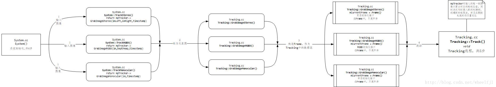
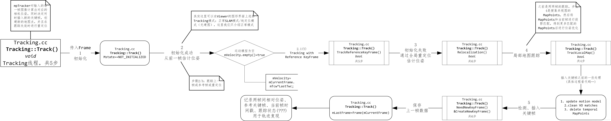
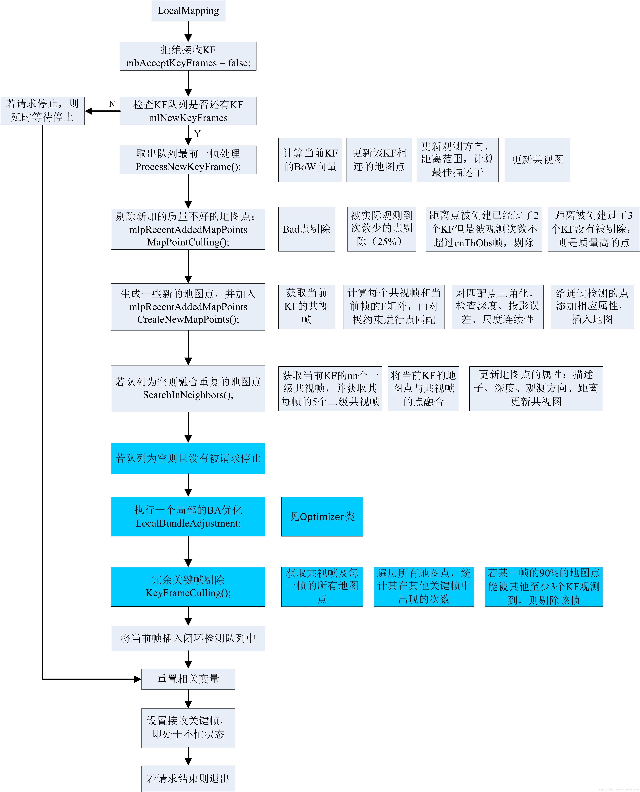
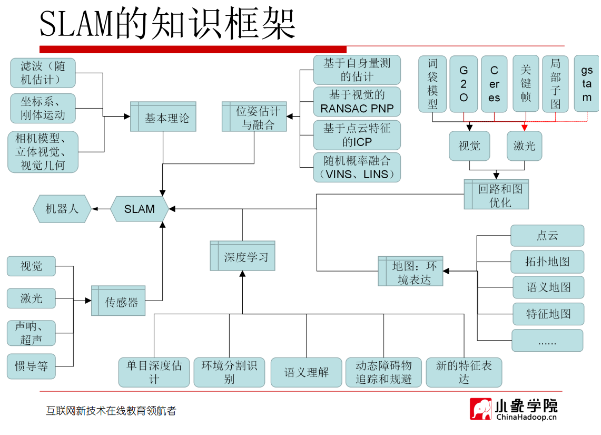
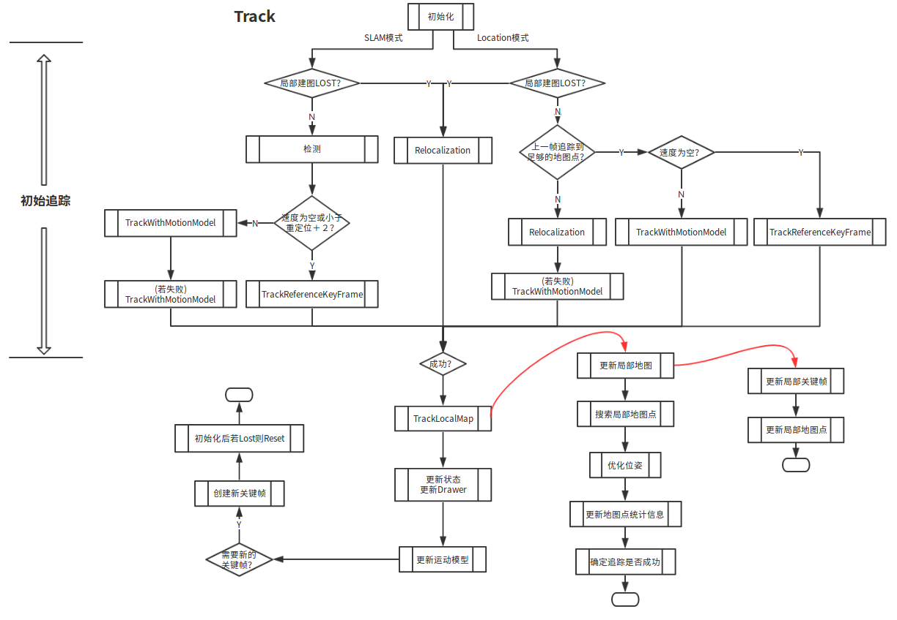
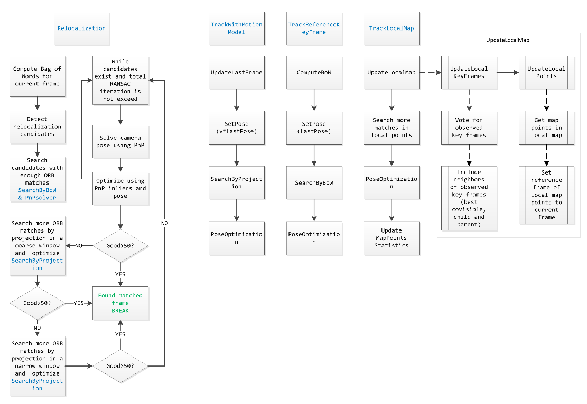
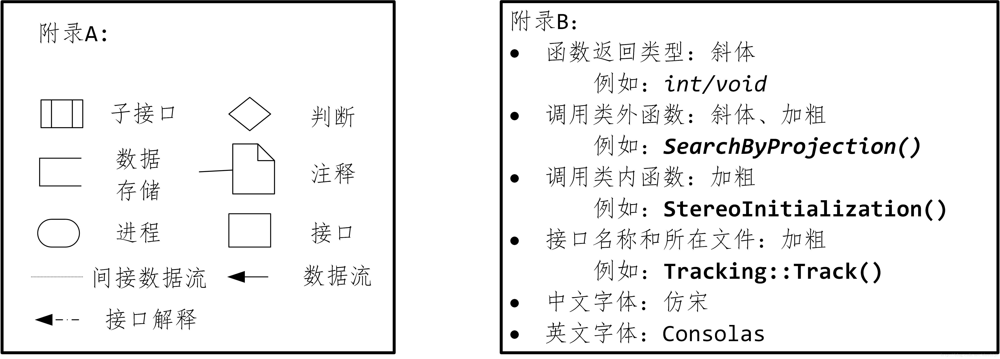

## 流程图

从System进入Tracking线程

从System进入Tracking线程1

Tracking线程的步骤概览

初始化1

初始化1.jpg)

初始化2

初始化2.jpg)

初始化3

初始化3.jpg)

初始化4
初始化4.jpg)

从运动模式_参考帧跟踪

从运动模式_参考帧跟踪.jpg)

重定位跟踪1

重定位跟踪1.jpg)

重定位跟踪2

重定位跟踪2.jpg)

重定位跟踪3

重定位跟踪3.jpg)

跟踪局部地图1

跟踪局部地图1.jpg)

跟踪局部地图2

跟踪局部地图2.jpg)

跟踪局部地图3

跟踪局部地图3.jpg)

关键帧插入

关键帧插入.jpg)

LocalMapping

orb

SLAM框架

SLAM脑图

Track

Tracking跟踪模型

附录

